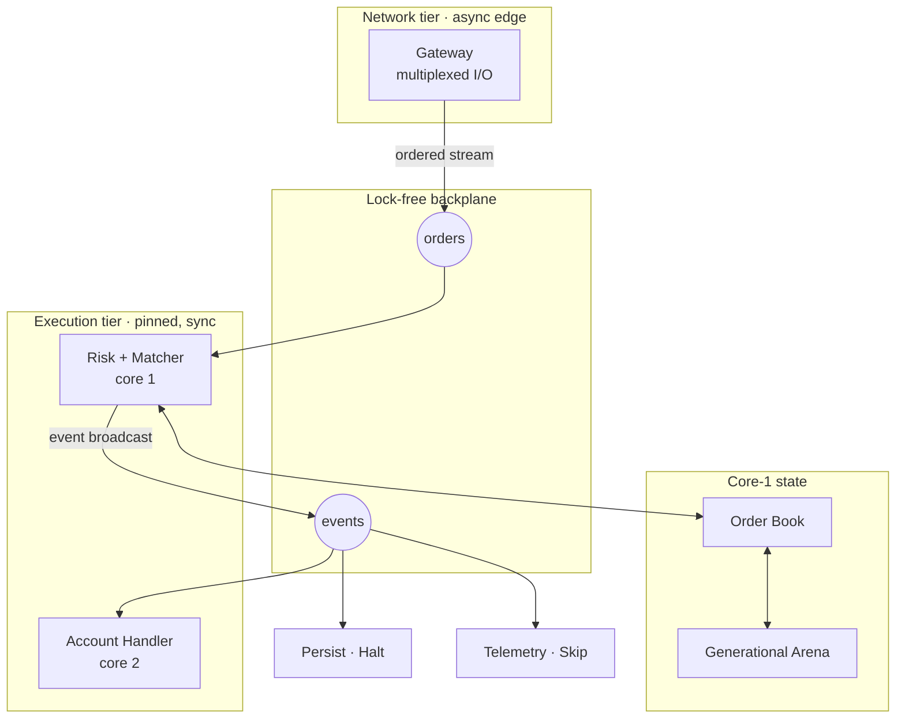
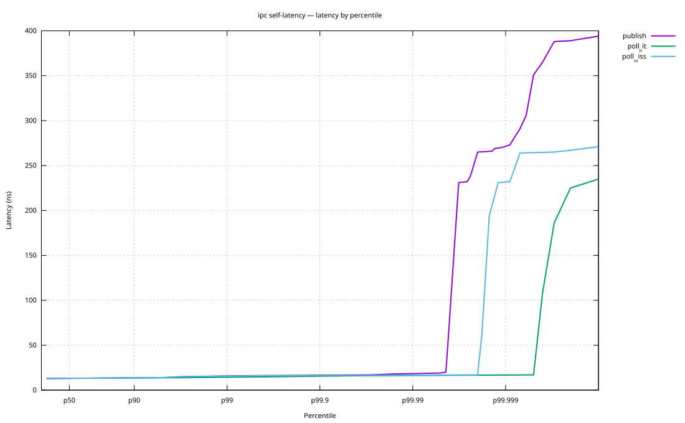
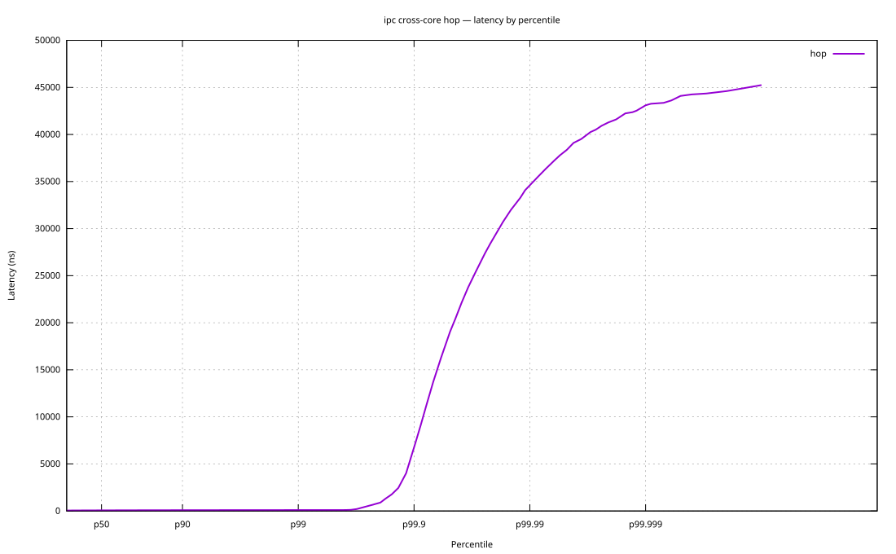
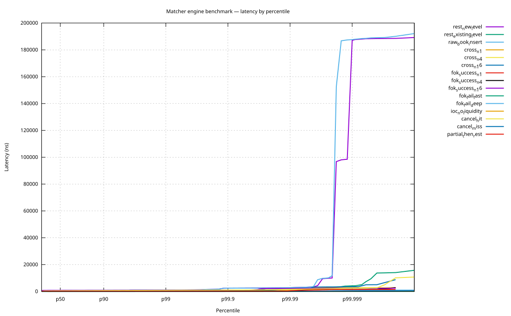

<div align="center">

# dex-core

### A full exchange stack in Rust: deterministic matching core, lock-free IPC backplane, async network edge.


**4.5M orders/s** on one core at **p99.99 < 1 µs**&nbsp;·&nbsp;**65 ns** to match an order&nbsp;·&nbsp;**0** allocations on the hot path

<sub>Realistic mixed workload, engine-internal, on a pinned isolated core at a measured 4.67 GHz. Latencies are medians unless a percentile is named; throughput is derived from mean service time. Full distributions and machine state live in <a href="docs/perf/2026-06-10">docs/perf</a>.</sub>

</div>

---

dex-core is a full exchange, written from scratch in Rust. The execution core is built and measured: lock-free IPC backplane, arena storage, order book, price-time matcher, and the measurement layer that proves the numbers. The network edge is in flight and persistence is next (see the [roadmap](#-8-roadmap)). Every layer is built with **mechanical sympathy**: shaped around the L1 cache and the CPU pipeline.

## 🎯 Why dex-core?

* **Mechanical sympathy.** It is built for the L1 cache and the CPU pipeline.
* **Actor model, zero sharing.** Each pinned core runs one single-threaded actor that owns its state outright. Actors talk only through the lock-free queues. There is no mutex to contend on, and determinism falls out of the design.
* **Verified concurrency.** The lock-free queue is loom model-checked, Miri-clean, and stress-tested for torn reads.
* **Honest tails.** Every latency is an HDR distribution. It is corrected for coordinated omission. It ships with the machine it ran on and the command to repeat it.
* **Lock-free IPC.** It is a custom SPMC seqlock backplane. There are no mutexes and no kernel-space syncing on the hot path.

---

## 🧱 1. The big picture: tiered architecture

dex-core isolates the chaos of network I/O from the strict timing of the matching core. Async lives only at the edge. It sits on the far side of a queue. The core is a set of pinned, single-threaded actors: synchronous, busy-polling, each owning its state outright.



---

## 🏛 2. Technical pillars

### I. The deterministic core (`matcher` + `orderbook`)
Price-time priority: a `BTreeMap` of price levels, a FIFO `VecDeque` per level, arena-backed order storage. Limit, IOC, and FOK time-in-force semantics, with FOK as a pre-checked gate: a failed FOK rejects in 23 ns and mutates nothing. The matcher is one single-threaded actor processing one order at a time. Same input stream, same fills, every run.

### II. Cache-line discipline (`ipc`)
Standard queues suffer from false sharing. dex-core pins every ring-buffer slot to its own 64-byte cache line. A producer's write never invalidates a consumer's metadata.

### III. Memory stability (`arena`)
Orders live in a **generational arena** instead of `Box<Order>`. There are no syscalls and no lock contention. Allocation and removal are O(1). Indices stay stable when the data moves. The hot path is **zero-allocation**, and a `dhat`-instrumented proof binary enforces it: 500K operations, zero heap blocks, or the run fails.

### IV. Honest concurrency (`ipc`)
The seqlock's optimistic read is a deliberate C11 data race. So loom can't model it directly. We verify what we can. loom checks the version ordering. Miri checks the unsafe code. A torn-read stress test covers the data path. The `Pod` payload bound makes a torn read safe to discard.

### V. Origin tracing (`telemetry`)
Latency is measured from the moment a message is born. A message carries its origin `rdtscp` tick: a few cycles to read, no syscall. Any stage downstream subtracts that tick from its own clock and knows the message's true age. The cross-core hop number is measured exactly this way; the consumer times the producer's embedded tick. The TSC is invariant and calibrated to wall-clock nanoseconds once at startup.

---

## 🔬 3. Micro-architectural analysis

### The stack, layer by layer

Each layer nests inside the next, so the costs compose. Latencies in ns from the published capture, one pinned isolated core at a measured 4.67 GHz.

| layer | operation | p50 | p99 | p99.99 | per-core rate |
| :--- | :--- | --: | --: | --: | --: |
| `arena` | allocate a slot | 13 | 14 | 16 | 79.6M/s |
| `orderbook` | pop the best order | 51 | 69 | 176 | 19.4M/s |
| `matcher` | match one order, one fill | 65 | 86 | 222 | 15.2M/s |
| `matcher` | realistic mixed workload | 76 | 637 | 919 | 4.5M/s |
| `ipc` | publish an event | 14 | 16 | 19 | 71.6M/s |
| `ipc` | core-to-core hop | 68 | 96 | 34,527 | — |

<sub>Rates are derived `1/mean`: single-core ceilings, not sustained throughput. The hop runs open-loop at 1M msgs/s across pinned cores 2→3; its p99.99 includes the platform noise an honest histogram keeps.</sub>

Wall-clock latency is one layer. We also audit the CPU pipeline. One command captures it. It needs `perf` and isolated cores.

```text
$ cargo bench-all --crate matcher --intent perfstat

   task-clock                 5,300.96 msec
   cycles               23,664,289,634      #   4.46 GHz
   instructions         50,895,148,070      #   2.15 insn per cycle   (IPC)
   branches              7,906,912,349      #   1.49 G/sec
   branch-misses            18,798,232      #   0.24% of all branches
   L1-dcache-loads      13,413,572,644      #   2.53 G/sec
   L1-dcache-load-misses   265,518,940      #   1.98% of L1 accesses
```

We report the raw counters. So you can check the IPC and the cache-miss rate yourself. The full capture lives in [`docs/perf/2026-06-10`](docs/perf/2026-06-10). It records the kernel, the governor, the effective clock, and every HDR histogram. The capture index and the clock policy live in [`docs/perf/README.md`](docs/perf/README.md).

### Latency distributions

Every curve is HDR-sampled and corrected for coordinated omission. The x-axis is log-percentile, so the tail stays legible.

| queue ops, single core | cross-core hop, cores 2→3 |
| :---: | :---: |
|  |  |



---

## ⚖️ 4. Traditional Rust vs. dex-core

Here is how the primitives compare to the usual safe-Rust defaults.

| | Traditional (`std` / `tokio`) | dex-core |
| :--- | :--- | :--- |
| **Concurrency** | `Mutex<VecDeque<T>>`, `mpsc` | SPMC seqlock (`ipc`) |
| **Allocation** | `Box<T>`, `Vec<T>` | generational arena, zero on the hot path |
| **I/O model** | multi-threaded async | async edge, pinned-sync core |
| **Latency** | microseconds, variable | publish p50 **14 ns**, hop p50 **68 ns** |
| **Determinism** | race-dependent | single-actor core (bit-identical replay on the roadmap) |

---

## 💻 5. API sneak peek

The backplane is ergonomic and zero-cost. It allocates once, up front. After that, the hot path never touches the heap.

```rust
use ipc::{LapPolicy, PollResult, Queue};

let (queue, mut producer) = Queue::<PodOrderEvent>::new(1024);
let mut consumer = Queue::subscribe(&queue, LapPolicy::Halt);

producer.publish(event);   // plain stores + a release fence. No lock, no alloc.

match consumer.poll() {
    PollResult::Ready(event) => process(event),  // a copy out of the slot, no deserialize
    PollResult::Empty => {}                       // nothing new yet
    _ => {}                                        // lapped: resolved per LapPolicy
}
```

<sub>`event` is a `PodOrderEvent`. That is a flat, `Pod` form of `OrderEvent`. The ring is typed `Queue<PodOrderEvent>`.</sub>

---

## ✅ 6. Verification & safety

dex-core uses a layered strategy. Each tool covers what the others cannot.

* **Unsafe code.** Miri validates it for alignment, provenance, and aliasing.
* **Concurrency.** loom model-checks the seqlock's commit ordering. A torn-read stress test covers the data path.
* **Portability.** Real `Release`/`Acquire` fences keep the protocol correct on AArch64 and Graviton as well as x86.
* **Allocation.** The hot path makes zero allocations. A `dhat` probe fails the run if one happens.

---

## ▶️ 7. Run it

You need Rust 2024 (stable). Miri needs nightly. The plots need gnuplot. The deep regimes need `perf` and valgrind.

```bash
cargo test  --workspace                                     # correctness
cargo bench-all capture                                     # the full canonical capture -> docs/perf/<sha>
cargo bench -p ipc --bench self_latency                     # per-op latency, HDR + SVG
cargo bench -p ipc --bench cross_core                        # cross-core hop latency
cargo run   -p ipc --release --example alloc_proof          # zero-allocation proof
RUSTFLAGS="--cfg loom" cargo test -p ipc --lib --release    # model-check the queue
cargo +nightly miri test -p ipc --test roundtrip --test lap_policy   # check the unsafe code
```

---

## 🗺 8. Roadmap

- [x] **`ipc`** — SPMC seqlock backplane (loom + Miri + stress + bench)
- [x] **`arena`** — generational-index storage
- [x] **`orderbook` + `matcher`** — price-time matching (limit, IOC, FOK)
- [x] **`telemetry` + `benchkit`** — the measurement layer (rdtscp, HDR, CO-correction)
- [ ] **`gateway`** (active) — bridge the network edge to the deterministic core
- [ ] **`persist`** (planned) — mmap-backed, hash-chained audit log
- [ ] **`risk` + actor wiring** (planned) — assemble the pinned-core actors
- [ ] **deterministic replay** (planned) — bit-identical state recovery

---

## 📄 License

This project is MIT licensed. See [LICENSE](LICENSE). Each crate has a low-level design document; they are being published alongside the engineering blog series.

<sub>It is built in the open and measured at every layer.</sub>
