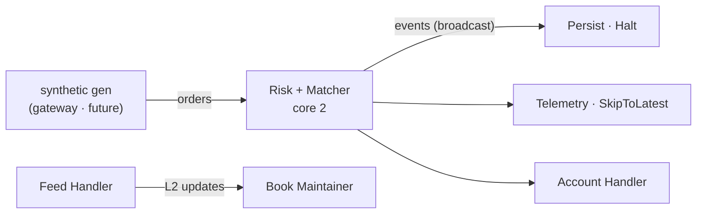
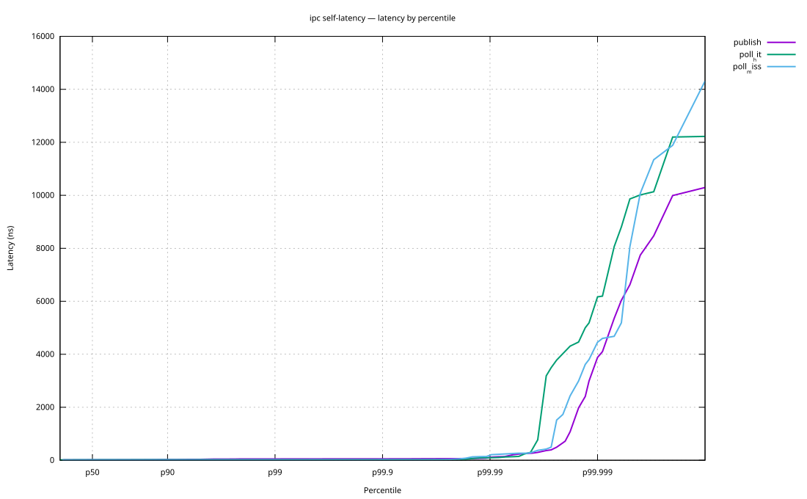
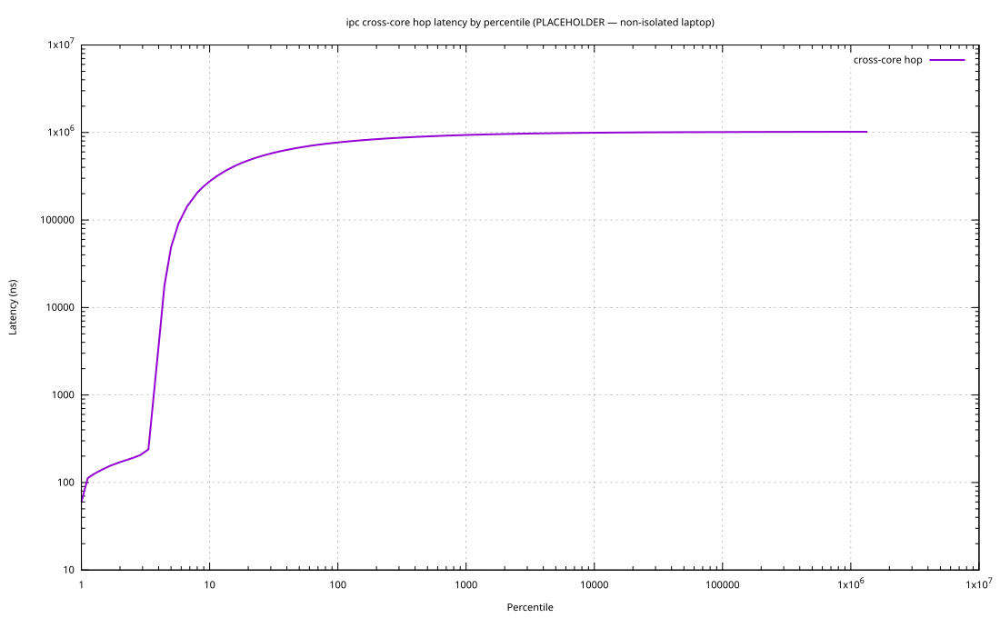

<div align="center">

# dex-core

### A lock-free order-matching engine in Rust, built from the cache line up.


</div>

---

dex-core is an order-matching engine written from scratch in Rust. It follows the HFT style. The matching core is built from actors. Each actor is a thread pinned to a CPU core. Actors talk only through lock-free queues. The core uses no locks and no async runtime. That is what keeps its latency tight. The network edge is a separate layer. It sits on the far side of a queue, so its I/O can never jitter the core.

The measurement tools were built first. So every speed number here has a real measurement behind it. The engine is built one primitive at a time. Each one is model-checked, run under Miri, and benchmarked before the next one starts.

> Most engines just say they are fast. This one shows the full latency curve, the machine it ran on, and the command to reproduce it. The concurrency is checked by a model checker.

## 📊 At a glance

|  |  |
|---|---|
| `publish` / `poll` latency, p50 | **14 ns / 18 ns** |
| cross-core queue hop | **~50 ns** floor (isolated-core p50/p99: <!-- TUNED -->) |
| hot path allocations | **0**, enforced by a test |
| IPC concurrency | loom-verified, Miri-clean, stress-tested |
| every number here | reproducible with `cargo bench` and `cargo test` |

> For scale: an uncontended mutex round-trip is about 20 ns. A main-memory miss is about 100 ns. A lock-free seqlock stays in that range, and it never blocks.

## ⚙️ What it matches

dex-core matches orders against a central limit order book. There is one book per instrument. Orders match by price first, then by time. It supports GTC, IOC, and FOK.

Here it is matching. Two sell makers rest at the same price. A buyer takes them, oldest first.

```rust
use matcher::Engine;

let mut engine = Engine::new();
engine.add_instrument(1, 64).unwrap();         // instrument id, book capacity

let mut events = Vec::new();
engine.process(&ask(100, 5), &mut events);     // sell 5 @ 100  -> rests
engine.process(&ask(100, 5), &mut events);     // sell 5 @ 100  -> rests (later)

events.clear();
engine.process(&bid_ioc(100, 8), &mut events); // buy 8 @ 100, immediate-or-cancel

// events == [Fill 5 @ 100, Fill 3 @ 100]
// The older maker fills first (time priority). IOC leaves nothing resting.
```

Send that same taker as FOK for 20 units and it rejects instead. Only 10 rest at its limit, and FOK is all-or-nothing.

<sub>`ask` and `bid_ioc` are shorthands that build an `OrderRequest`. The real call is `engine.process(&request, &mut events)`.</sub>

## 🧱 Architecture

Each actor is a thread pinned to a core. It runs a busy loop. It reads its inputs, does its work, writes its outputs, and repeats. Actors only talk through lock-free queues. There are no locks. Nothing shared is mutated outside the seqlock protocol. Async lives only at the network edge, on the far side of a queue.



This is the latency budget for one order. The marks show how much of it is measured today.

```
 order → ack                          measured?
 ──────────────────────────────────────────────
 network in    ████████████           off-box
 gateway       ▒▒                      roadmap
 ipc hop       ▌  ~50 ns               yes
 risk + match  ▌▌ <500 ns              yes
 ipc hop       ▌  ~50 ns               yes
 consumer      ▒                       roadmap
```

## ⚡ Performance

Every number comes from the project's own tool, [`benchkit`](crates/benchkit). It records latency as an HDR histogram. It plots latency by percentile. That is how tails are actually read. It also corrects for coordinated omission. You can run it yourself with `cargo bench`.

**Per-op latency. `publish` and `poll`, one thread, self-timed:**



**Cross-core hop latency. Producer core to consumer core:**



> <sub>These plots are placeholders. They come from a normal laptop on `powersave`, not a tuned machine. The fat tails are the OS scheduler, not the queue. The coordinated-omission correction makes that noise visible instead of hiding it. The real plots come from isolated cores.</sub>

## 🔬 Under the hood

Latency tells you how fast. These tell you why. The same harness reads hardware perf counters and probes allocations.

ipc hot path, per `publish` / `poll`:

| metric | result | source |
|---|---|---|
| heap allocations | **0** (a test fails if it isn't) | dhat probe |
| instructions / op | <!-- TUNED --> | `perf stat` |
| IPC (insn / cycle) | <!-- TUNED --> | `perf stat` |
| L1 / LLC misses | <!-- TUNED --> | `perf stat` |
| branch misses | <!-- TUNED --> | `perf stat` |

Generate the perf counters on one command (needs `perf`):

```bash
cargo bench-all --crate ipc --intent perfstat,alloc
```

## 📦 The crates

dex-core is a workspace of small, focused crates. Each one has its own README.

| crate | what it is | verified by |
|---|---|---|
| [`ipc`](crates/ipc) | SPMC seqlock broadcast queue. The lock-free backbone. | loom · Miri · stress · bench |
| [`telemetry`](crates/telemetry) | `rdtscp` clock, TSC calibration, HDR histograms | unit tests |
| [`benchkit`](crates/benchkit) | the measurement harness. HDR, CO-correction, plots. | — |
| [`matcher`](crates/matcher) | the matching engine (limit, IOC, FOK) | tests · bench |
| [`orderbook`](crates/orderbook) | L2 order book | tests |
| [`arena`](crates/arena) | generational-index allocator (~13 ns alloc) | tests · bench |
| [`types`](crates/types) | zero-copy wire types (`Pod`), `intent_hash` anchor | tests |

## 🔍 A few problems worth a look

**A seqlock that is honest about its data race.** The read can race the write. This is a known, safe seqlock pattern. But it is still a C11 data race, so loom cannot model it. So the queue's ordering is loom-checked where it can be. The unsafe code is checked with Miri. The racy data path is covered by a torn-read stress test. → [`ipc`](crates/ipc)

**Durability is a type.** One producer broadcasts to many consumers. Each consumer picks a policy. The audit log uses `Halt`. It cannot miss an event. Market data uses `Skip`. It only wants the latest value. The policy lives in the type, not in a comment. → [`ipc`](crates/ipc)

**Measurement you can't fool yourself with.** The harness corrects for coordinated omission. It records the machine it ran on. It hands you the command to repeat the run. → [`benchkit`](crates/benchkit)

## ✅ Verification

`ipc` is the only lock-free crate. So it gets the full treatment.

```
              loom   Miri   stress   HDR-bench
  ipc          ✓      ✓        ✓         ✓
```

The other crates run on one thread. They are covered by unit tests and benchmarks. loom and the stress test are concurrency tools. They apply to the queue, not to plain logic.

## 🔁 Reproduce it

Needs Rust 2024 (stable). Miri needs the nightly toolchain. The plots need gnuplot. The deep regimes need `perf` and valgrind.

```bash
cargo test  --workspace                                     # correctness
cargo bench -p ipc --bench self_latency                     # per-op latency, HDR + SVG
cargo bench -p ipc --bench cross_core                        # cross-core hop latency
cargo run -p ipc --release --example alloc_proof            # zero-allocation proof
RUSTFLAGS="--cfg loom" cargo test -p ipc --lib --release    # model-check the queue
cargo +nightly miri test -p ipc --test roundtrip --test lap_policy   # check the unsafe code
```

## 🚧 Status

Built and verified: `types`, `arena`, `telemetry`, `benchkit`, `orderbook`, `matcher`, `ipc`.

In progress: `persist` (hash-chained audit log), `risk`, the actor-wiring layer (`exchange`), and the network gateway.

<sub>Design notes live in [`docs/lld/`](docs/lld), one document per crate.</sub>

## 📄 License

MIT. See [LICENSE](LICENSE).
